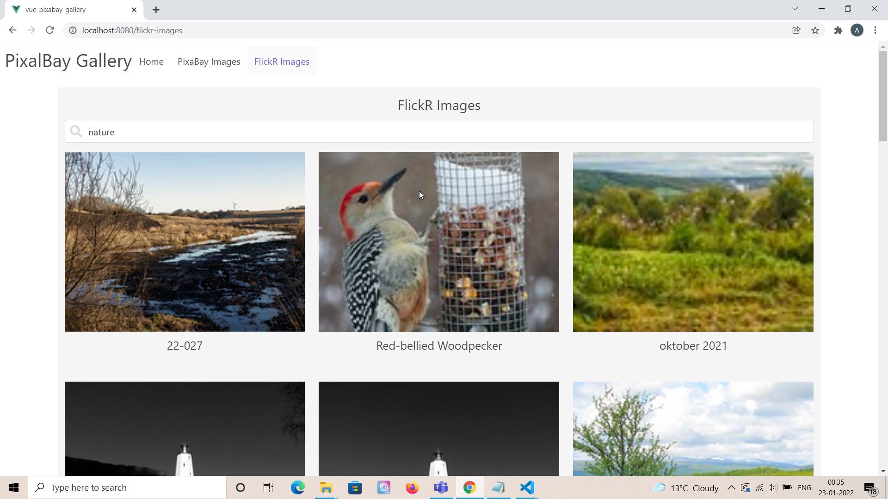

# PixaBay Gallery in Vue and Buefy


## Project Briefing

This is a carousel based gallery app created using Vue and Buefy. For images it uses API provided by [PixaBay](https://pixabay.com/) which is free for limited usage.
Carousel is derived from Buefy which is a UI Library based on Bulma CSS for Vue.

I had a lot of fun making this project, completed it in around 2 hours. I used Bulma CSS after an extended gap of like couple of years.

## Built With

* [Vue](https://vuejs.org/)
* [Buefy](https://buefy.org/)
* [PixaBay API](https://pixabay.com/api/docs/)

## Authors

* **Amit Prafulla (APFirebolt)** - (https://apgiiit.com/)

## 💾 Project setup

Simply install node modules for frontend, setup your env file and enter the API keys which you should have retrieved from PixaBay and Flickr websites respectively. The API limits usage on an hourly basis to somewhere around 100 requests. But, it should be suffice for Educational and Experimental purposes.


```
npm install
npm run serve
```

For production, build the frontend of the app and run the production build. 

```
npm run build

VUE_APP_PIXABAY_API_KEY=your API Key
VUE_APP_FLICKR_API_KEY=your API Key
```
## 🚅 Project Features

- Carousel based image gallery.
- Uses Buefy for UI components like Carousel, Loaders, Buttons and more.
- Uses PixaBay API for images.

## Project Updates

- Added Flickr API view (23rd January 2022), might add pagination later.

## Future Feature Additions

- Mobile friendly menu could be added in the future.

## Project Screenshots

Please find some of the application screenshots below.Screenshot of the rather simple homepage with a Hero component in Bulma CSS.


Top view of the images page, it uses Bulma Cards inside of carousel Buefy component. Icons are powered by "font-awesome" and related dependencies of Vue and Font-Awesome.


Shows search bar with search icon. Clicking on the search icon would trigger the search API which would fetch the images with associated keywords from pixabay API.


Shows the newly added flickr images page where you can fetch images from Flickr using keywords in case you have the flickr API configured in the project.




